# Registro de Empresa en el Extranjero

## 1. Hola a todos
Hola a todos, soy QiLong, un novato en la internacionalización, con poco más de un año de experiencia en este campo. Al principio, sabía muy poco sobre la internacionalización y no sabía por dónde empezar. Luego, por recomendación de un amigo, me uní a comunidades y grupos de internacionalización. ¡Después de unirme a estas comunidades y grupos, fue como abrir las puertas a un nuevo mundo! No tenía idea de que el mundo de la internacionalización fuera tan emocionante y fascinante.

En este año y pico, desde aprender a encontrar palabras clave (demanda), aprender SEO, paso a paso, he desarrollado y lanzado 4 sitios web de herramientas. Aunque estos sitios aún no han generado ingresos, no me desanimo, porque creo que si sigues adelante, ganar dinero es cuestión de tiempo.

Los 4 sitios web que lancé, especialmente el más reciente [Image AI](https://imgai.ai), me han ayudado mucho tanto técnica como comercialmente. Técnicamente, no hace falta decir, cada vez soy más hábil. Comercialmente, lo más importante es que finalmente logré completar todo el flujo de pagos del sitio web.

Bueno, esa fue mi breve presentación personal. Ahora vamos a completar paso a paso el "flujo completo de pagos del sitio web".

> Hola a todos, [Style Art AI](https://styleart.ai/) es mi sitio web recién desarrollado, es un sitio web de generación de imágenes basado en GPT 4o, que puede personalizar o seleccionar estilos predefinidos del sitio web para generar imágenes, es bastante interesante, si están interesados, pueden probarlo.

## 2. Panorama general del flujo completo

> *Aviso especial*: Al registrar una empresa, asegúrate de entender claramente qué tipo de empresa necesitas registrar: LLC (Compañía de Responsabilidad Limitada de un solo miembro), INC (Corporación), etc. Generalmente registramos una empresa tipo LLC, ya que la verificación comercial de Stripe es más simple para empresas LLC.
>Algunos amigos han registrado empresas tipo INC, y al solicitar Stripe, el número de teléfono debe coincidir con el lugar de registro de la empresa. Si no tienes un número de teléfono de la región correspondiente, puede ser bastante problemático, mientras que LLC puede elegir China.

### Panorama general del flujo completo

Para implementar el flujo completo de pagos de sitios web internacionales, necesitamos completar varias acciones previas importantes, como se muestra en la imagen:

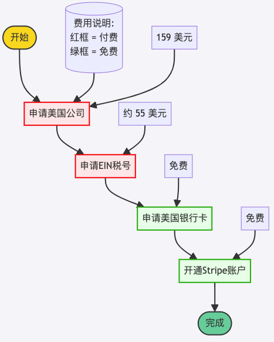

> Nota:
> - El "Informe de Información de Beneficiario Real" cuando me registré costaba solo 9 dólares, ahora ha subido de precio, cuesta 25 dólares.
> - La tarifa de registro de la empresa también ha subido, antes eran 100 dólares, ahora son 104 dólares.
> - Así que en la imagen de arriba, 159 dólares -> 179 dólares.
> - Si necesitan registrarse, es mejor actuar pronto.

### Tiempo necesario
Esta fue la primera vez que completé todo el flujo, tomó bastante tiempo. Desde la solicitud de registro de empresa el 2 de junio hasta la activación de Stripe el 22 de julio, ¡tomó un total de 51 días! Durante este período tomé muchos desvíos (intenté dos veces con Mercury Bank), encontré muchos obstáculos (como que el IRS escribió mal el nombre del representante legal de la empresa), y la mayor parte del tiempo fue de espera.

Mi situación fue bastante especial, todos no deberían necesitar tanto tiempo. A continuación está el tiempo aproximado requerido para el flujo normal, solo para referencia.

| Proceso | Tiempo requerido (días laborables) |
|:-----------------|:----------------:|
| Registro de empresa | 3 días |
| Solicitud de EIN | 10 días |
| Apertura de tarjeta bancaria comercial estadounidense | 5～7 días |
| Activación de Stripe | 0 días |

**Nota:** Los días listados arriba son todos días laborables, no incluyen fines de semana ni días festivos.

## 3. Registro de empresa en el extranjero
En este artículo, les voy a enseñar cómo registrar una empresa en el extranjero. Yo registré una empresa estadounidense, así que aquí usaré una empresa estadounidense como ejemplo.

### (1) Dirección de registro
👉 [wyomingagents](https://www.wyomingagents.com/)
(También recomiendo una plataforma nacional de registro de empresas en el extranjero, pueden conocer más sobre [IngStart](https://www.ingstart.com?s=QL))

wyomingagents es una agencia que proporciona servicios de registro y gestión de empresas en el estado de Wyoming, Estados Unidos. Wyoming tiene impuestos muy bajos, adecuado para pequeños equipos o individuos para registrar empresas, con bajo costo.

### (2) Proceso de registro
- Seleccionar "Form a Company" (Formar una empresa)
>  - Aquí muestra que registrar una empresa cuesta solo $150, hay una opción de "Informe de Información de Beneficiario Real" que debe agregarse, se explicará más adelante.
>  - No es necesario registrarse primero en este sitio web, en el proceso posterior te pedirán que te registres.

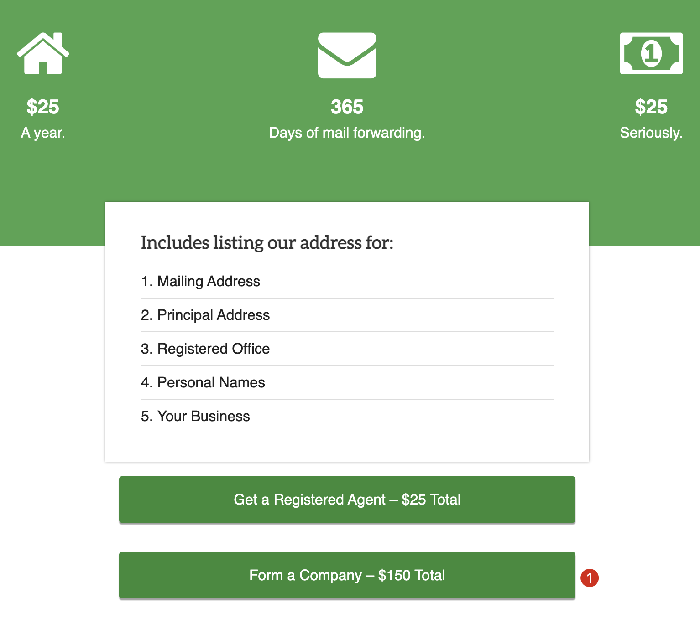

- Llenar información
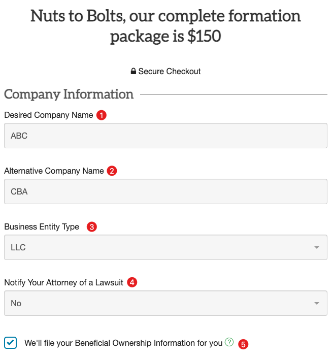

① **Desired Company Name (Nombre deseado de la empresa)**: Llenar el nombre de tu empresa (nombre de empresa en inglés)

② **Alternative Company Name (Nombre alternativo de la empresa)**: Llenar el nombre alternativo de tu empresa, esto es para prevenir el caso de que el nombre de empresa anterior no esté disponible, puedes elegir este nombre alternativo para registrar.

③ **Business Entity Type (Tipo de entidad empresarial)**: Somos una empresa personal, así que seleccionar LLC (Compañía de Responsabilidad Limitada de un solo miembro) está bien.

④ **Notify Your Attorney of a Lawsuit (Notificar a tu abogado sobre una demanda)**: Seleccionar NO, porque no tenemos abogado.

⑤ **"We'll file your Beneficial Ownership Information for you"
(Presentaremos tu información de propiedad beneficiaria por ti)**: Se recomienda encarecidamente marcar esto directamente. El "Informe de Información de Beneficiario Real" es requerido por la ley federal estadounidense para que la mayoría de las empresas estadounidenses nuevas y existentes reporten información sobre sus beneficiarios reales a la Red de Cumplimiento de Delitos Financieros (FinCEN) del Departamento del Tesoro de EE.UU. Además, proporcionar información de propiedad beneficiaria puede aumentar la transparencia de la empresa, muchos bancos requieren información de propiedad beneficiaria al abrir cuentas para empresas. Preparar esta información con anticipación puede hacer que el proceso de apertura de cuentas bancarias sea más fluido. Si olvidas marcar esto aquí, después de que la empresa se registre exitosamente, puedes solicitarlo nuevamente, o encontrar canales de terceros para solicitarlo, eso sería muy problemático, mejor marcarlo directamente aquí.

---
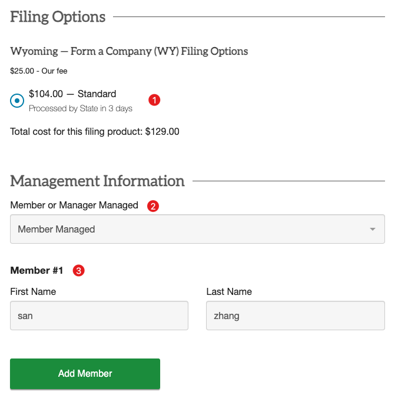

① **Opción de tarifa**: Las empresas LLC solo tienen esta opción, por defecto está bien. Ha subido de precio, 100 dólares -> 104 dólares.

② **Member or Manager Managed (Gestionado por miembro o gerente)**: Por defecto está bien.

③ **Member #1 (Miembro #1)**: Somos una empresa de una persona, naturalmente los miembros de la empresa somos solo nosotros, llenar nuestro propio nombre, en pinyin, por ejemplo Zhang San, entonces, First Name es san, Last Name es zhang.

④ Si tienes socios, haz clic en "Add Member" para agregar.

---
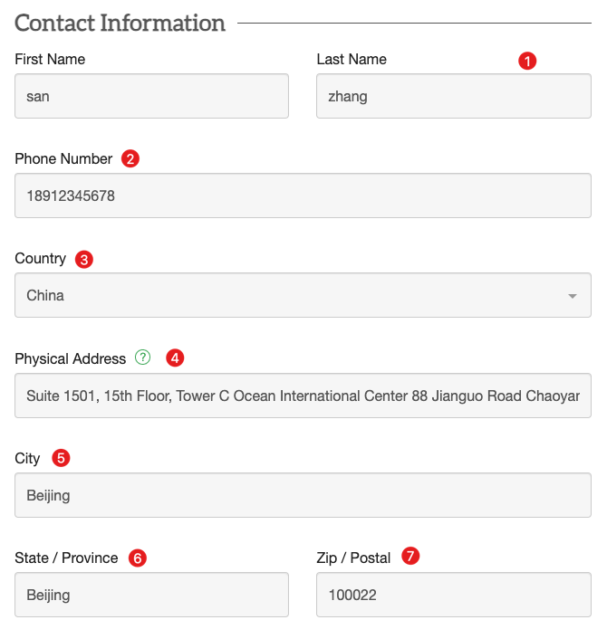

① **First Name, Last Name (Nombre)**: Igual que arriba, llenar tu nombre en pinyin.

② **Phone Number (Número de teléfono)**: Llenar tu número de teléfono móvil real.

③ **Country (País)**: China (seleccionar el país de tu nacionalidad).

④ **Physical Address (Dirección física)**: Llenar la dirección real, este paso es muy importante, asegúrate de llenar tu dirección real. Yo llené mi dirección de residencia, una casa alquilada. Se recomienda escribir la dirección en chino (la dirección donde normalmente recibes paquetes), luego usar IA para traducirla al inglés.

⑤ **City (Ciudad)**: Llenar la ciudad donde vives a largo plazo, en pinyin.

⑥ **State / Province (Estado/Provincia)**: De igual manera, llenar la provincia o ciudad donde vives a largo plazo, en pinyin.

⑦ **Zip / Postal (Código postal)**: De igual manera, llenar el código postal de tu lugar de residencia a largo plazo.

---
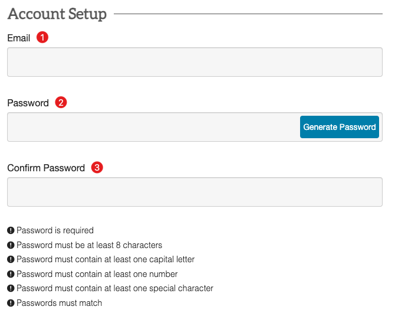

① **Email (Correo electrónico)**: Este paso es para registrarse en el sitio web wyomingagents. Llenar tu correo electrónico más usado.

② **Password (Contraseña)**: Contraseña, asegúrate de llenar la contraseña según los requisitos, los requisitos de contraseña son bastante complejos, guárdala bien, no la olvides, todos los documentos relacionados con la empresa se guardarán en este sitio web, conveniente para revisarlos en cualquier momento.
- La contraseña debe tener al menos 8 caracteres
- La contraseña debe contener al menos una letra mayúscula
- La contraseña debe contener al menos un número
- La contraseña debe contener al menos un carácter especial

③ **Confirm Password (Confirmar contraseña)**: Confirmar contraseña, requiere que las dos contraseñas ingresadas sean idénticas.

---
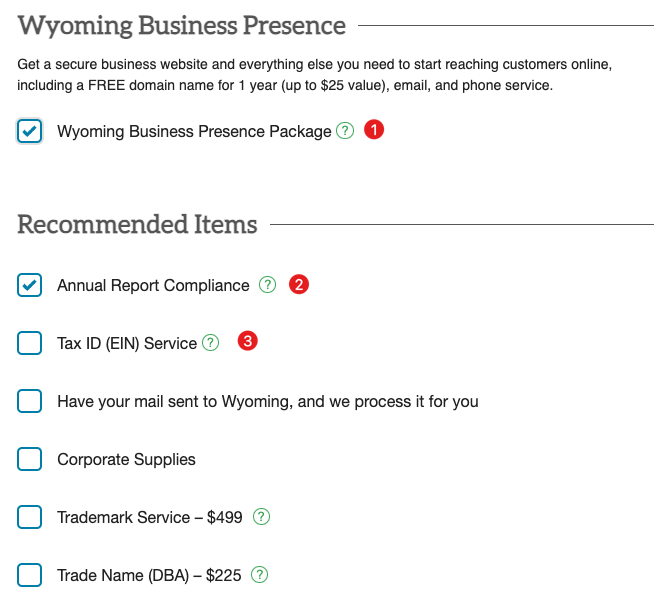

① **Wyoming Business Presence Package (Paquete de presencia empresarial de Wyoming)**: Este paquete incluye:
- 1 año de dominio gratuito (valor hasta 25 dólares): Más tarde te pedirán que proporciones un dominio de empresa, luego usarán automáticamente WordPress para construir un sitio web oficial de empresa muy simple, casi inutilizable, necesitas ir al backend para modificarlo tú mismo.
- Servicio de correo electrónico y teléfono: Proporcionarán un número de teléfono gratuito de prueba de Wyoming, Estados Unidos, con APP, puede recibir mensajes de texto (probado efectivo, pero no puede recibir códigos de verificación de Telegram, pregunté a los oficiales, dijeron que debería ser posible, pero no lo recibí, puede ser por la red u otras razones, no me preocupo), la llamada de red parece no funcionar muy bien, casi no la usas.

② **Annual Report Compliance (Cumplimiento de informe anual)**: Seleccionado por defecto, gratuito, esto es un requisito legal, cada empresa debe presentarlo en su aniversario de constitución. El incumplimiento puede resultar en la disolución de la empresa por el gobierno estatal, las consecuencias son muy graves.

③ **Tax ID (EIN) Service (Servicio de ID fiscal (EIN))**: ¡EIN es muy importante! Lo necesitarás para solicitar tarjetas bancarias estadounidenses y activar Stripe posteriormente. Pero aquí no lo seleccioné, demasiado caro, para ciudadanos estadounidenses solo cuesta 75 dólares, pero para no ciudadanos estadounidenses cuesta 250 dólares, la diferencia es demasiado grande, muy caro, puedes ir al sitio web oficial del IRS o encontrar a alguien de terceros para solicitarlo, en el artículo posterior "2. Solicitud de EIN" se explicará detalladamente cómo operar y evitar obstáculos.

④ Otros, como Corporate Supplies (Suministros corporativos), Trademark Service – $499 (Servicio de marca registrada – $499), Trade Name (DBA) – $225 (Nombre comercial (DBA) – $225), etc., generalmente no son necesarios, no los selecciones.

---
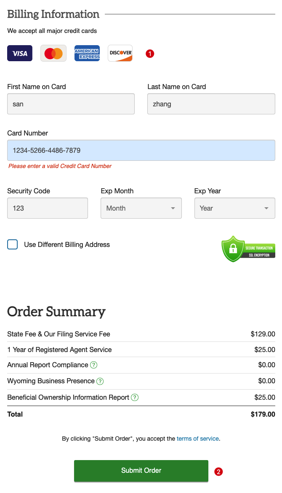

① Llenar información de pago, confirmar factura, usar una tarjeta de crédito Visa nacional está bien, yo usé una tarjeta Visa de China Merchants Bank.

② Después de confirmar que no hay errores, hacer clic en enviar orden, recibir mensaje de deducción (en junio de este año fueron 159 dólares, ahora ha subido de precio), lo que significa que la orden de registro de empresa fue exitosa, ahora solo esperar, generalmente en unos 3 días se puede registrar, bastante rápido.

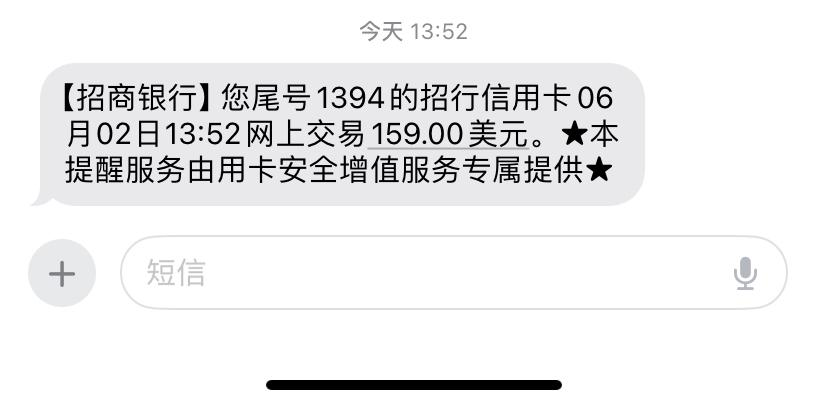

### (3) Confirmar información de registro
Después de completar la orden de registro de empresa anterior, la parte de llenar información está completa. A continuación, iniciar sesión en el sitio web, confirmar la información de la empresa llenada en la orden, el proceso es bastante simple, solo voy a pegar las capturas de pantalla que tomé en ese momento.

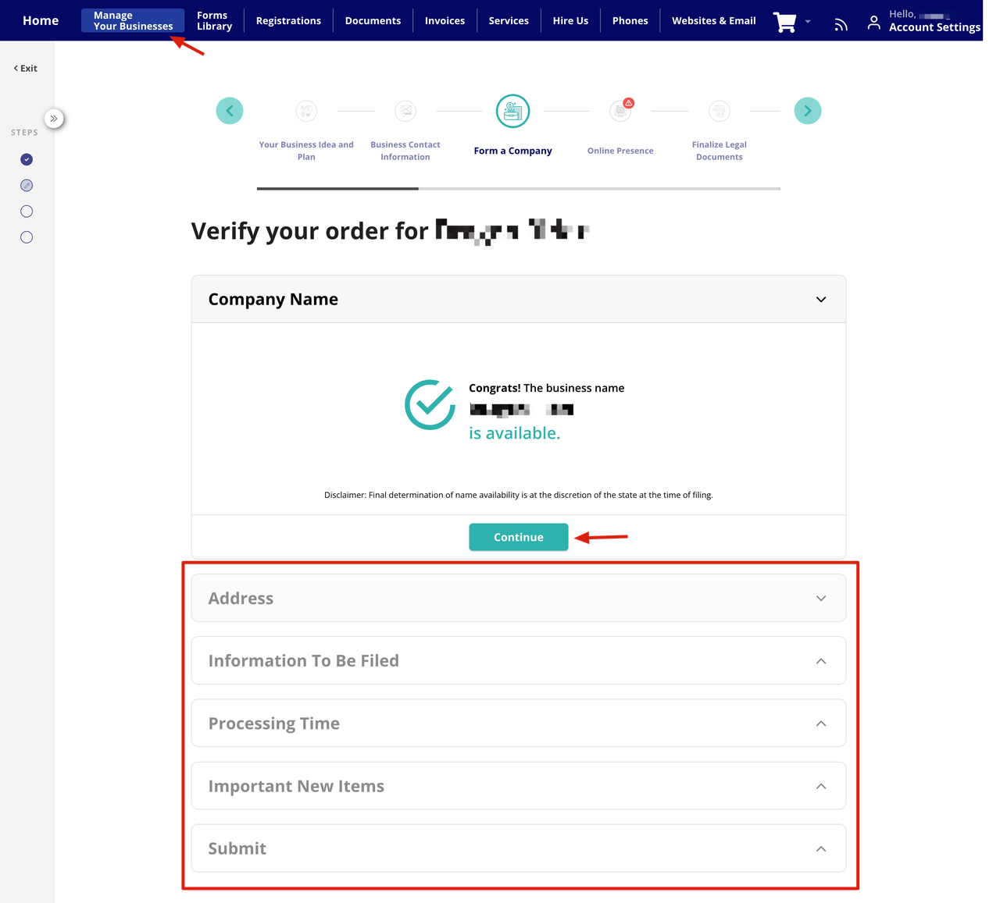

- El contenido en el marco rojo necesita ser confirmado.
- Luego, hacer clic en "Continue", verificar varia información.

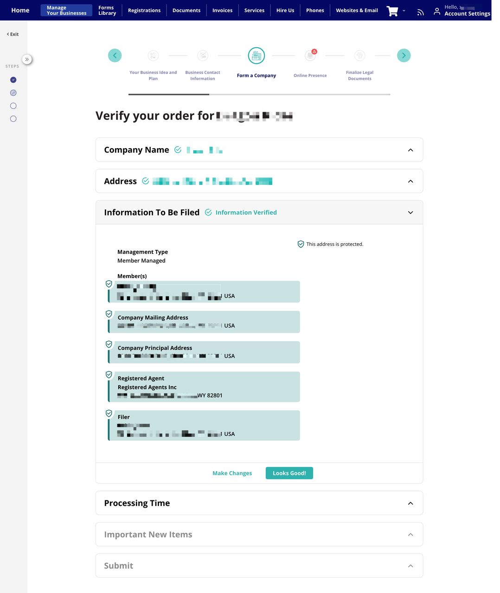

- Después de confirmar la información, te darán una dirección de agente de la empresa en Estados Unidos, esta dirección es la dirección de registro de la empresa, se usa en muchos lugares, anótala.

Hasta aquí, la solicitud de registro de empresa estadounidense en Wyoming está completa, solo esperar tranquilamente. Después de unos días, revisar el sitio web oficial, después de que la empresa se registre exitosamente, puedes ver los documentos relacionados con la empresa en el sitio web: Operating Agreement (Acuerdo operativo, documento importante), Initial Resolution (Resolución inicial), Formation Document (Documento de constitución)

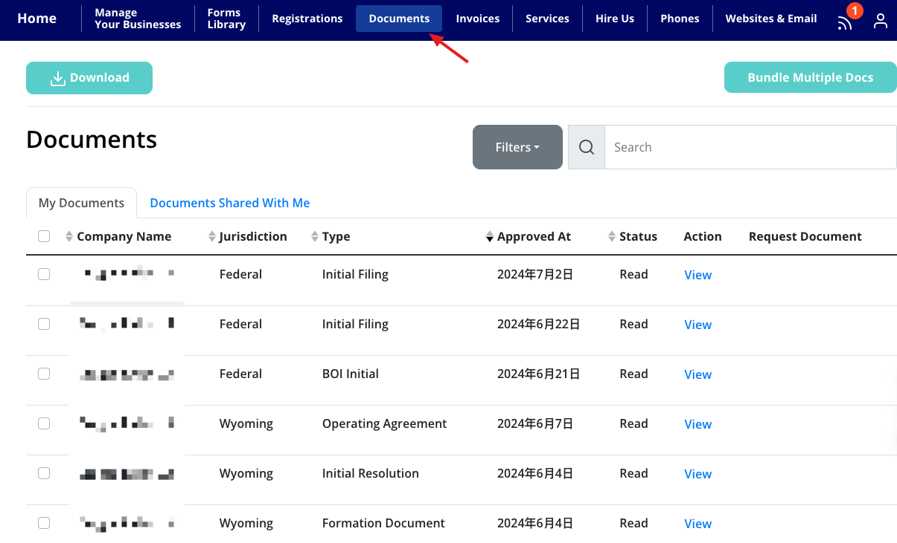

### (4) Otros
- En el proceso de registro anterior, el paquete incluye sitio web, número de teléfono, correo electrónico comercial, etc., pueden iniciar sesión en el backend del sitio web para revisar.
- El sitio web de la empresa está desplegado y publicado con WordPress, el backend proporciona cuenta y contraseña, iniciar sesión en WP para modificar el sitio web oficial, el primer año es gratuito, después necesitas pagar, puedes cancelar la renovación en el backend.
- La cuenta de correo de la empresa es lo mismo, puedes iniciar sesión en el backend del correo para enviar y recibir correos.
- Número de teléfono estadounidense, descargar su APP, iniciar sesión para enviar y recibir mensajes de texto.
- El correo electrónico comercial, SSL, teléfono y sitio web después del período de prueba gratuito, cada artículo cuesta 9 dólares por mes. El dominio después del período de prueba gratuito de 1 año, se cobra anualmente según el precio de mercado del dominio, 25 dólares. Los servicios de renovación y servicio de agente registrado se cobran anualmente.

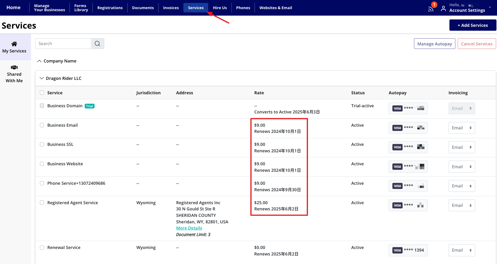

## 4. Palabras finales
Lo anterior es el flujo básico de operación para registrar una empresa estadounidense, bastante simple. Si necesitan, recomiendo registrarse pronto para evitar otro aumento de precios, para una empresa de una persona, ahorrar un poco es un poco.

Hay que notar que si necesitas abrir el pago de Airwallex, entonces asegúrate de **registrar una empresa británica**, también me enteré después, las empresas estadounidenses no pueden solicitarlo, a menos que tengas identidad estadounidense. Pero puede abrir tarjetas bancarias estadounidenses, con tarjetas bancarias puedes recibir pagos de Stripe.

Antes de solicitar tarjetas bancarias, necesitas primero solicitar el EIN de la empresa, por favor ve a [2. Solicitud de EIN](./2-solicitud-ein.md)

# Recomiendo una plataforma nacional de registro de empresas en el extranjero
-  Sitio web: [IngStart](https://www.ingstart.com?s=QL)

Recientemente conocí la plataforma IngStart, me parece bastante interesante. Principalmente ayuda a registrar empresas en Estados Unidos, Hong Kong, Reino Unido y Singapur, y también proporciona algunos servicios de cumplimiento y fiscales.

Parece bastante conveniente de usar, puedes registrar una cuenta en línea, luego completar todo el proceso de registro en línea. También te ayudan con direcciones de agente e información de accionistas.

Creo que su ventaja es que concentra todo en un lugar, también es bastante simple de gestionar. Y tiene servicio en chino, bastante amigable para nosotros, precios también muy competitivos, lo importante es: **¡servicio integral, conveniente!**

Si están interesados en esto, pueden ir a su sitio web y preguntar al servicio al cliente, deberían poder aprender más detalles. En general, parece una opción bastante buena, especialmente para aquellos que quieren abrir empresas en el extranjero pero no quieren demasiadas complicaciones.
