# Solicitud de Tarjeta Bancaria Estadounidense

## 1. ¿Por qué solicitar una tarjeta bancaria comercial estadounidense?
- Activar Stripe requiere una tarjeta bancaria comercial, no se recomienda usar tarjeta bancaria personal.
- Separar las finanzas personales y comerciales puede evitar algunos problemas fiscales.
- Hay otros beneficios, puedes buscarlos en Google.

## 2. Elegir la institución para abrir la tarjeta bancaria
Para estudiantes de internacionalización, probablemente han escuchado más sobre "Mercury Bank". "Mercury Bank" en realidad no es un banco, es una institución financiera confiable. Las tarjetas de Mercury son especialmente adecuadas para pequeños equipos y empresas individuales, convenientes y de bajo costo.

Pero ahora Mercury Bank parece ser cada vez más estricto con usuarios nacionales. Solicité dos veces y no fue aprobado. Cuando pregunté por correo electrónico a los oficiales, tampoco dieron razones específicas, todos los materiales fueron enviados según los requisitos.

Más tarde, abandoné la solicitud a Mercury Bank. Me enteré de que "Airwallex" también puede abrir tarjetas bancarias comerciales estadounidenses, así que fui a solicitarla.

## 3. Abrir tarjeta bancaria comercial estadounidense de "Airwallex"
> Por favor nota, si necesitas abrir la funcionalidad de pago de "Airwallex", asegúrate de solicitar una empresa británica o de Hong Kong, o comunícate con el personal oficial antes de solicitar.

### (1) Dirección
👉 [Airwallex](https://www.airwallex.com/cn/signup)

### (2) Proceso de apertura
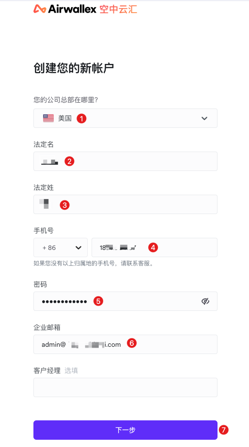

① País donde está registrada la empresa: Estados Unidos

② y ③ Nombre del representante legal de la empresa, es decir, tu propio nombre, aquí puedes llenar tu nombre en chino.

④ Número de teléfono: Llenar tu número de teléfono que estés usando actualmente.

⑤ Contraseña: Contraseña para iniciar sesión en "Airwallex", recuérdala bien.

⑥ Correo corporativo: Llené el correo que solicité al registrar la empresa.

---

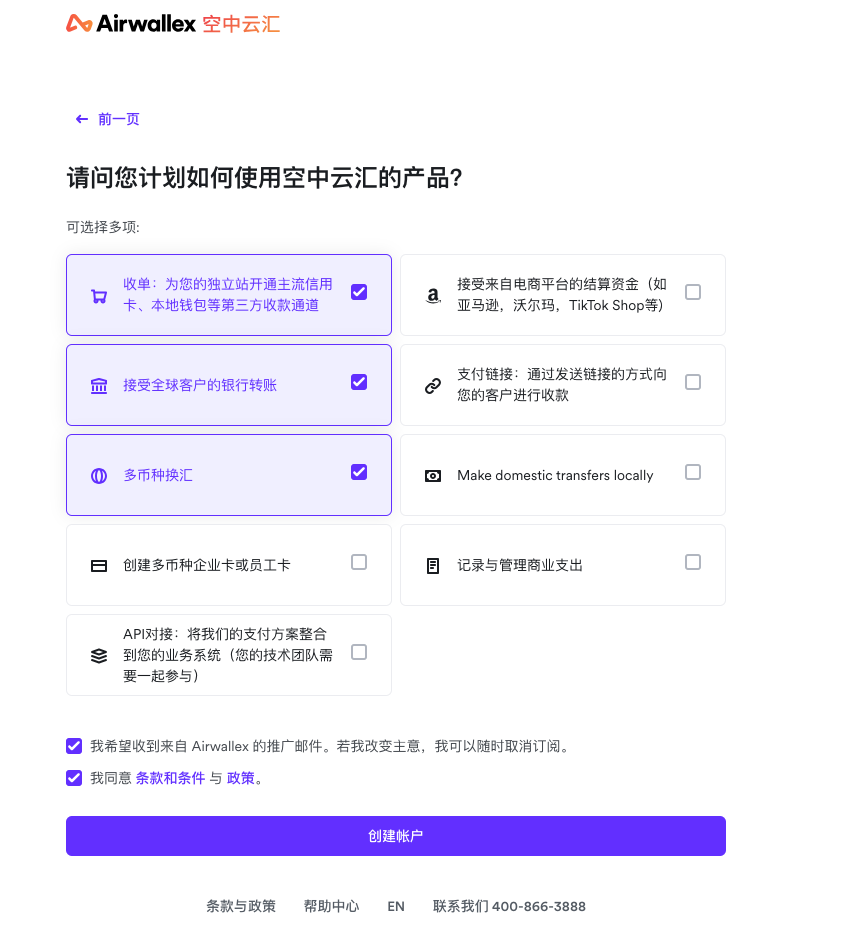

Seleccionar el propósito de abrir "Airwallex", generalmente, seleccionar "Recaudación, recibir transferencias, cambio multicurrencia" estas 3 es suficiente.

---

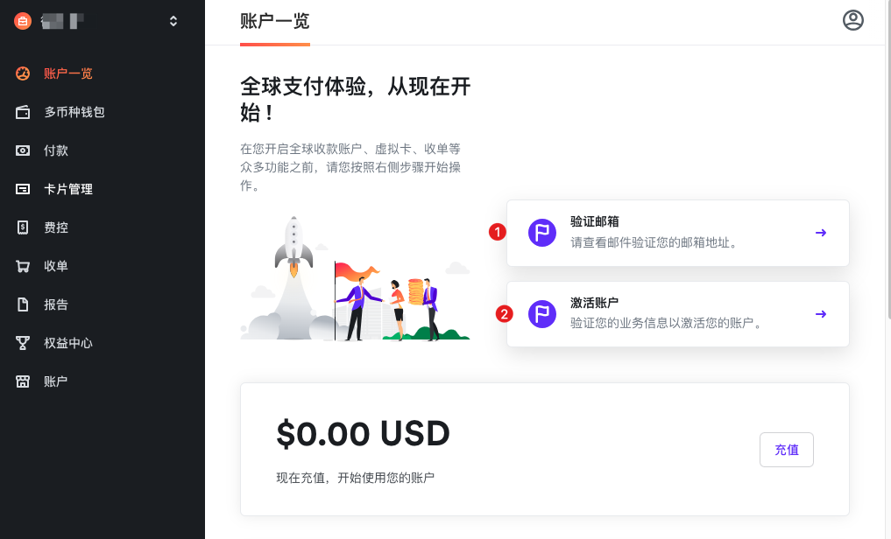

① **Verificar correo**: Bastante simple, hacer clic para entrar y verificar.

② **Activar cuenta**: Este paso es algo tedioso, dividido en 10 pequeños módulos, con bastante información que llenar, a continuación voy a introducir uno por uno.

---
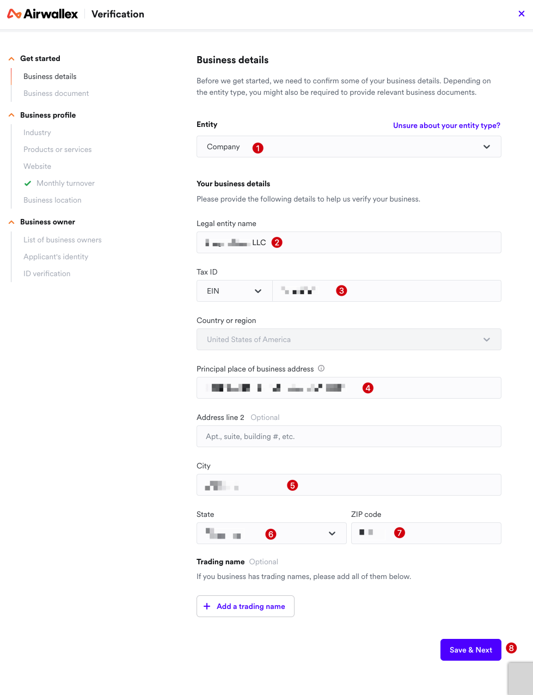

① **Entity (Tipo de entidad)**: Seleccionar "Company".

② **Legal entity name (Nombre de entidad legal)**: Nombre de la empresa, por ejemplo: ABC LLC.

③ **EIN (Número de Identificación del Empleador)**: Aquí es el número fiscal solicitado en [Solicitud de EIN](./2-solicitud-ein.md).

④ **Principal place of business address (Dirección principal del lugar de negocios)**: Llenar la dirección válida actual donde resides habitualmente, igual que al solicitar el registro de empresa.

⑤, ⑥, ⑦ Muy simple, llenar la ciudad correspondiente a la dirección, provincia/ciudad y código postal correspondiente.

---
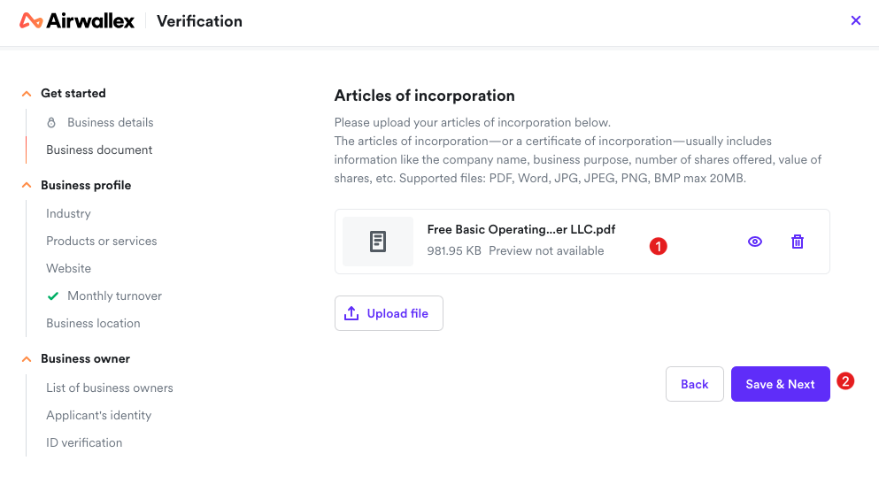

① Este paso requiere subir el archivo de registro de empresa de [Registro de Empresa en el Extranjero](./1-registro-empresa-extranjero.md), descargarlo y subirlo.

---
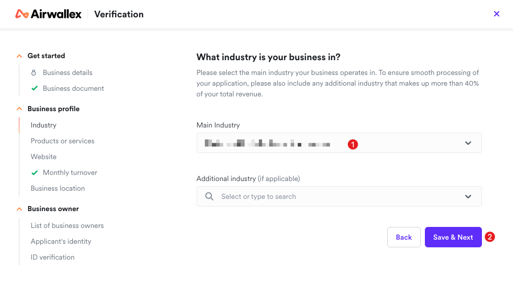

① Seleccionar la industria principal en la que opera tu empresa, elegir según tu industria principal.

---
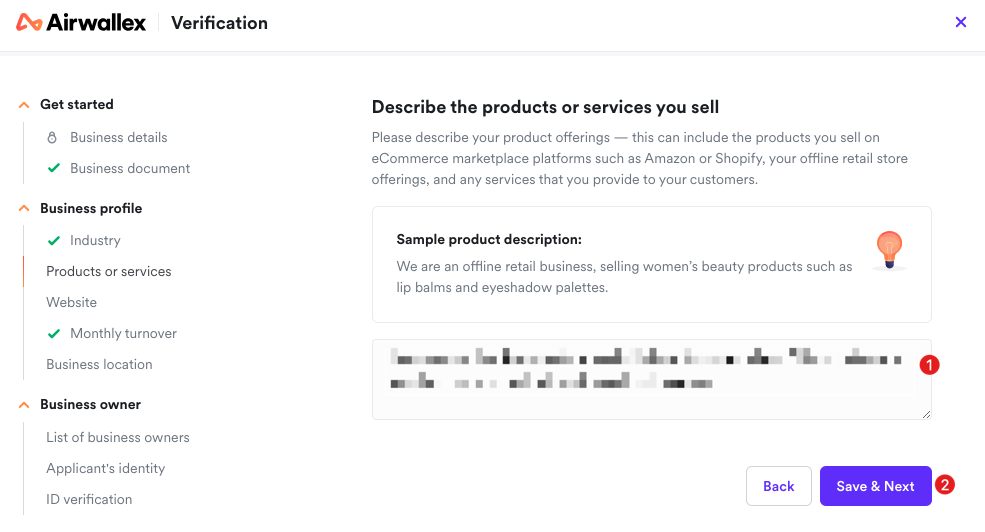

① Aquí llenar la descripción de productos o servicios de tu empresa, llenar según la situación real, siguiendo el ejemplo de escritura, simple, claro y conciso.

---
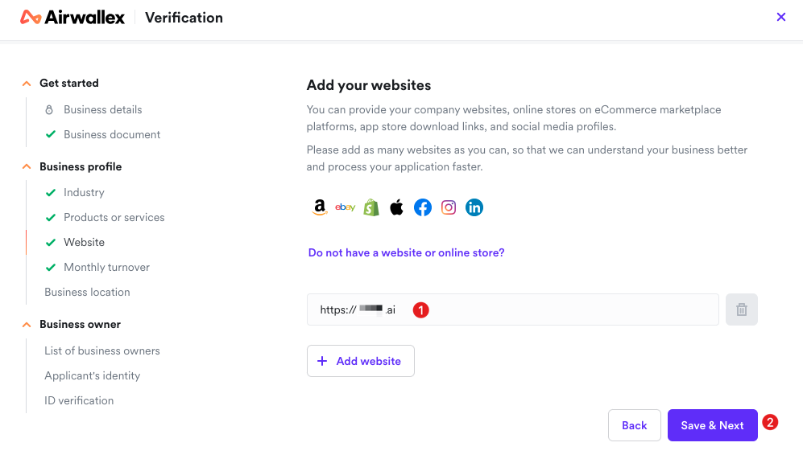

① Llenar la dirección de tu sitio web, nota que debe ser un sitio web ya en línea, puede ser el sitio web oficial de tu propia empresa, el sitio web no debe ser demasiado simple, como un sitio web normal, preferiblemente relacionado con el negocio que llenaste anteriormente. También puede ser una tienda en línea en plataformas de comercio electrónico, enlaces de descarga de tiendas de aplicaciones y perfiles de redes sociales. Puedes agregar múltiples sitios web, después de todo es revisión manual, mientras más detallados y reales sean los materiales, más fácil es pasar.

---
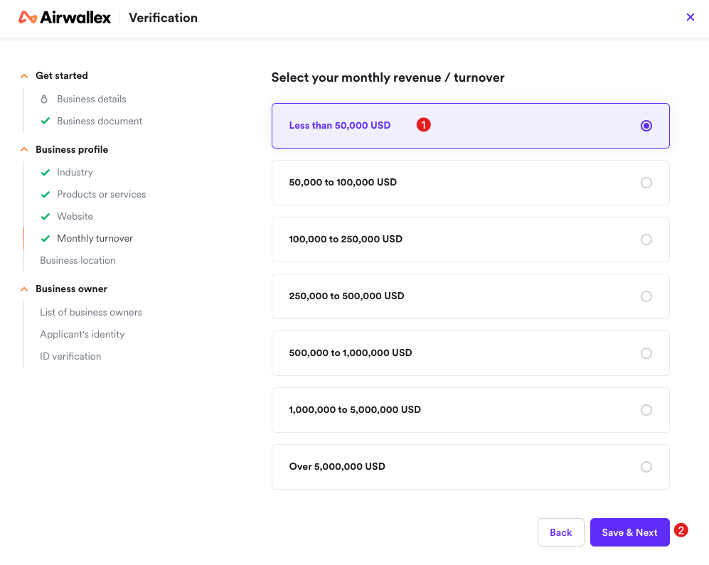

① Seleccionar los ingresos mensuales o facturación de los productos o servicios de tu empresa, si aún no tienes ingresos, seleccionar el primero, el más bajo.

---
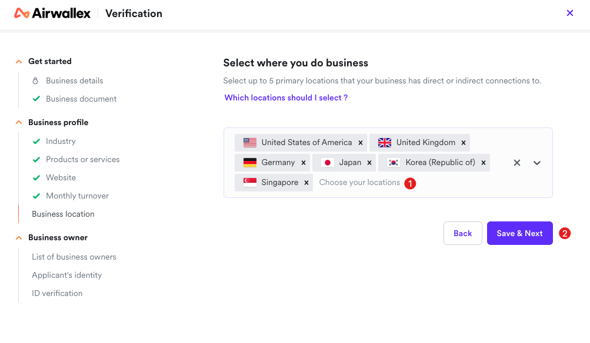

① Seleccionar las regiones donde desarrollas tu negocio, máximo seleccionar 5 regiones, si es un negocio dirigido globalmente, seleccionar algunos países principales.

---
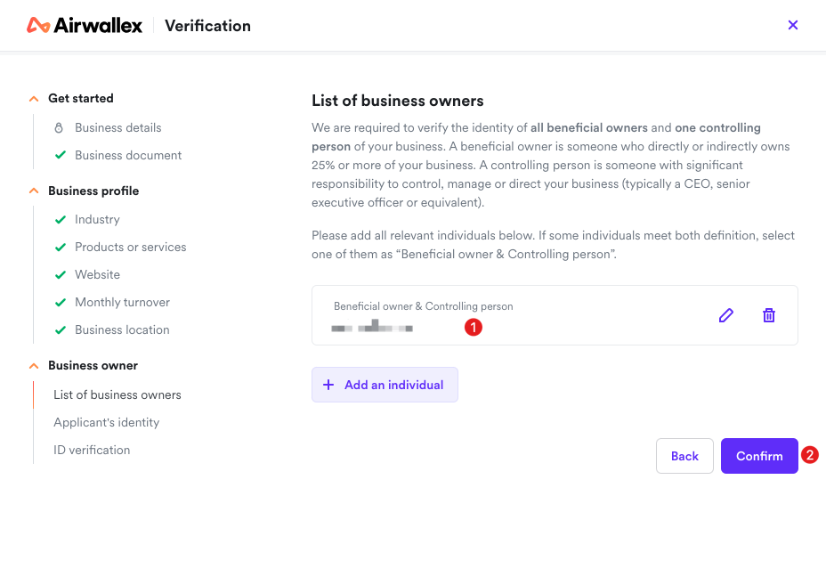

① Llenar el controlador real de tu empresa, si es una empresa de una persona, llenar tu propio nombre, si hay socios, continuar agregando.

---
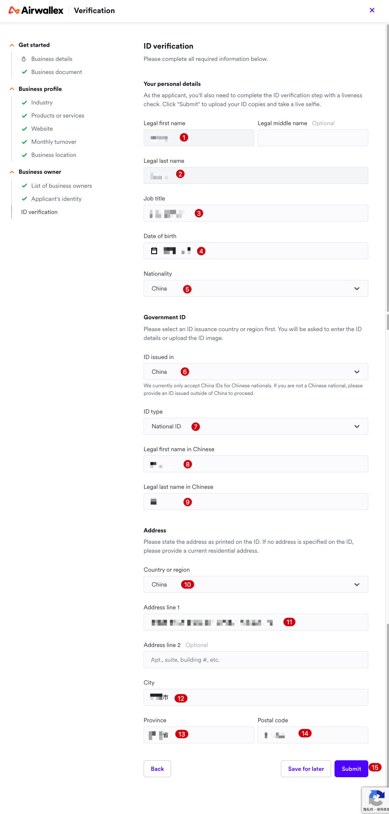

> Aquí se llena la información del solicitante. Como solicitantes, también necesitamos completar el paso de confirmación de identidad en tiempo real en línea. Después de hacer clic en "Submit", el sistema nos guiará para subir copias de identificación y verificar nuestra identidad a través de una simple interacción de video.

①～⑤ Llenar tu nombre, posición, fecha de nacimiento y nacionalidad, etc., no necesito repetir.

⑥～⑨ Llenar documento de identidad gubernamental: "Airwallex" actualmente solo acepta cédulas de identidad chinas de ciudadanos chinos. Si no eres ciudadano chino, necesitas proporcionar documentos de identidad emitidos fuera de China. Podemos seleccionar directamente cédula de identidad personal, aquí seleccionar, cuando llegue el momento de confirmación de identidad en tiempo real en línea, te pedirán tomar fotos.

⑩～⑭ Llenar la información de dirección donde residimos actualmente, aquí puedes llenar directamente la dirección en chino.

⑮ Después de hacer clic en "Submit" para enviar, saltará a la parte de verificación de identidad en línea, seguir las instrucciones para operar y verificar, bastante simple.

---
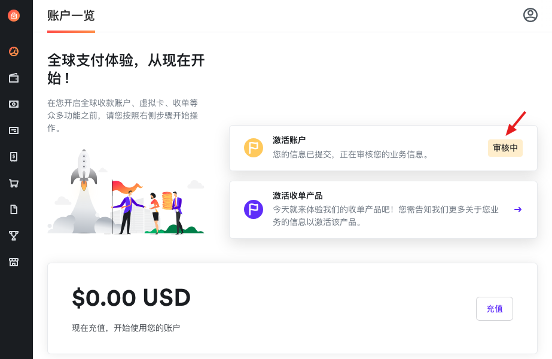

Después de completar la información anterior, podemos ver que "activar cuenta" se convierte en estado "en revisión".

## 3. Palabras finales
Para ser repetitivo, si necesitas la funcionalidad de pago de "Airwallex", entonces por favor registra una empresa británica o de Hong Kong, las empresas estadounidenses casi no funcionan (a menos que tengas nacionalidad estadounidense), este es el resultado de mi comunicación con los oficiales.

Sin embargo, generalmente no usamos la funcionalidad de pago de "Airwallex", poder abrir un banco estadounidense para recibir pagos es suficiente, para la funcionalidad de pago activamos directamente Stripe.

Después de llenar el proceso de solicitud de "Airwallex", simplemente esperamos, generalmente en 3～5 días laborables, el personal de "Airwallex" te llamará por teléfono, solo para confirmar alguna información y explicar qué condiciones y materiales se necesitan para que una empresa estadounidense abra todas las funcionalidades de "Airwallex".

En ese momento no nos comunicamos claramente, pensé que las empresas estadounidenses no podían abrir "Airwallex", estaba preparándome para buscar otras soluciones alternativas, pero después de unos días, recibí un mensaje de texto, ¡la cuenta se abrió exitosamente!

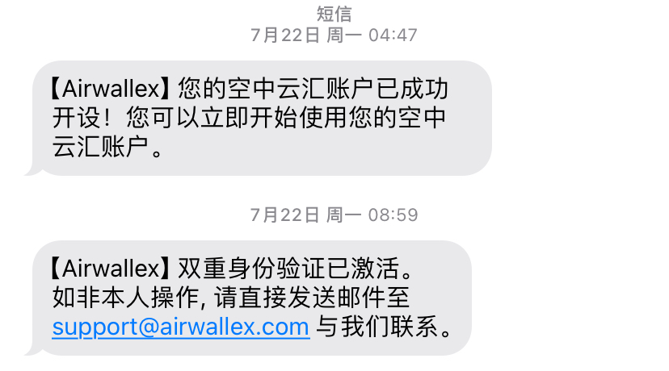

Luego, iniciamos sesión en el sitio web de "Airwallex", vamos al backend para seleccionar y abrir la tarjeta bancaria comercial estadounidense.

Hasta aquí, finalmente completamos la apertura de la tarjeta bancaria comercial estadounidense, ahora es el último paso del flujo completo de recepción de pagos de sitios web internacionales, por favor ve a [4. Activación de Stripe](./4-activacion-stripe.md)
