# Activación de Stripe

Creo que todos, si hacen sitios web internacionales, habrán escuchado sobre Stripe. Stripe es seguro y confiable, fácil de usar, con tarifas relativamente bajas y buena experiencia de pago para clientes, se puede decir que es la primera opción de pago para sitios web internacionales.

Los estudiantes que ven esto ya deberían tener preparada la empresa, EIN y tarjeta bancaria comercial extranjera. Si aún no las tienen preparadas, por favor consulten primero los siguientes 3 artículos como referencia.
[1. Registro de Empresa en el Extranjero](./1-registro-empresa-extranjero.md)
[2. Solicitud de EIN](./2-solicitud-ein.md)
[3. Solicitud de Tarjeta Bancaria Estadounidense](./3-solicitud-tarjeta-bancaria-estadounidense.md)

Ahora vamos paso a paso a activar Stripe.

## 1. Activación de Stripe

### (1) Dirección

👉 [Sitio web oficial de Stripe](https://stripe.com/)

### (2) Activar Stripe

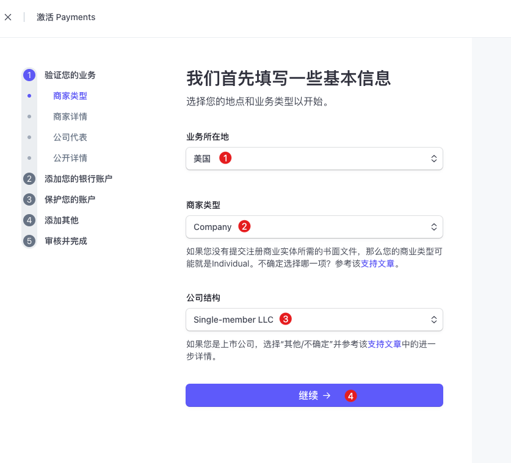

① **Ubicación del negocio**: Estados Unidos, seleccionar el país real donde está registrada tu empresa.

② **Tipo de comerciante**: Seleccionar Company.

③ **Estructura de la empresa**: Single-member LLC, seleccionar el tipo real de tu empresa.

---
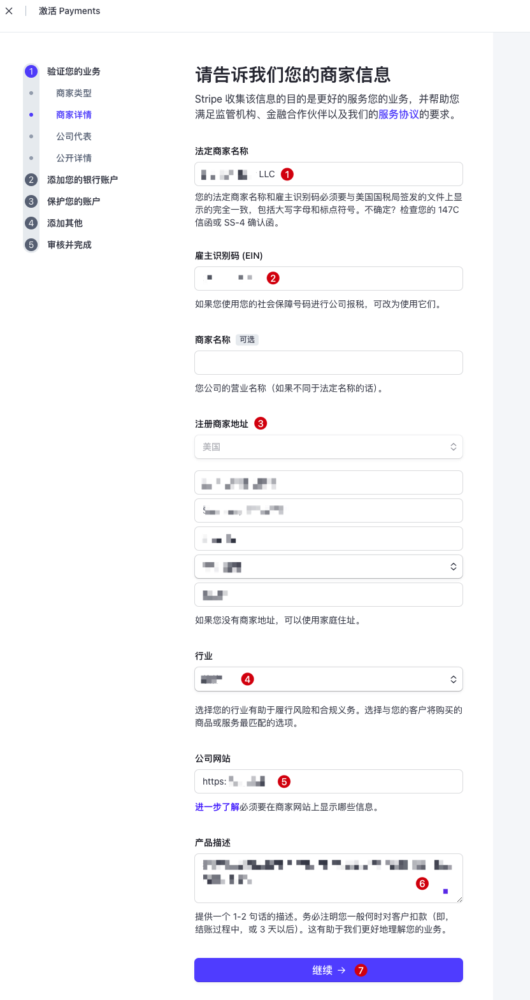

① **Nombre legal del comerciante**: Llenar el nombre de tu empresa registrada.

② **Código de Identificación del Empleador (EIN)**: Llenar el número fiscal EIN de la empresa.

③ **Dirección de registro del comerciante**: Aquí llenar la dirección extranjera de la empresa proporcionada al registrar la empresa extranjera.

④ **Industria**: Seleccionar la industria a la que pertenecen los productos o servicios reales de la empresa.

⑤ **Sitio web de la empresa**: Aquí puedes llenar el sitio web oficial de la empresa construido al solicitar la empresa, pero si es demasiado simple no funcionará, puede ser otro sitio web ya en línea, yo llené el sitio web de IA de imágenes que recién lancé: https://imgai.ai

⑥ **Descripción del producto**: Llenar las funcionalidades que proporciona el sitio web, describir de manera concisa y real.

---
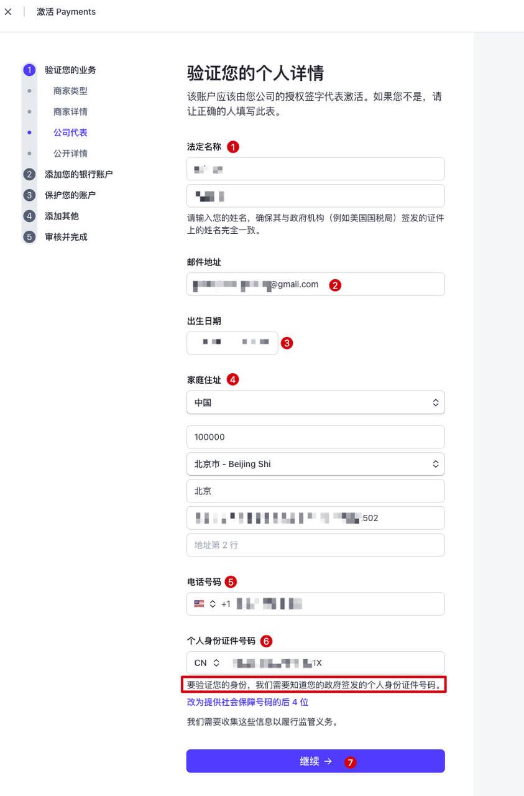

① **Nombre legal**: Este paso es para verificar la información del representante legal de la empresa. Aquí llenar tu propio nombre, en chino está bien.

② **Dirección de correo electrónico**: Llenar tu correo electrónico de uso común, se recomienda correo de Google.

③ **Fecha de nacimiento**: Llenar tu fecha de nacimiento, mantener consistencia con la cédula de identidad.

④ **Dirección de residencia**: Llenar tu dirección de residencia actual habitual.

⑤ **Número de teléfono**: Aquí llené el número estadounidense que compré al registrar la empresa, si no tienes, llenar el número de teléfono móvil chino también debería funcionar.

⑥ **Número de cédula de identidad personal**: Seleccionar China (CN), luego llenar tu número de cédula de identidad.

---
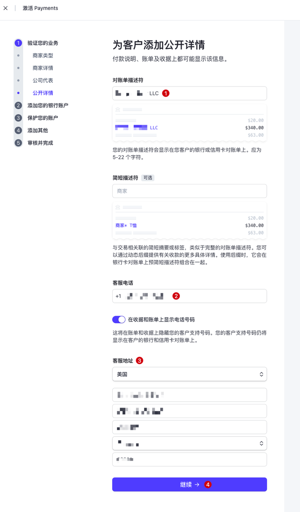

> Esta parte son los detalles públicos de la empresa proporcionados a los clientes, esta información puede mostrarse en descripciones de pago, facturas o recibos.

① **Descriptor de estado de cuenta**: Llenar directamente el nombre de la empresa.

② **Teléfono de atención al cliente**: Llené el teléfono de la empresa, puedes desactivar la visualización en recibos y facturas.

③ **Dirección de atención al cliente**: Llené la dirección de registro estadounidense de la empresa.

---
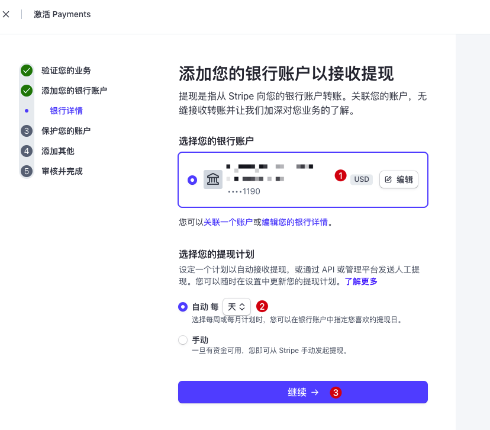

① **Seleccionar tu cuenta bancaria**: Aquí llenar directamente la información de la tarjeta bancaria comercial estadounidense solicitada en [3. Solicitud de Tarjeta Bancaria Estadounidense](./3-solicitud-tarjeta-bancaria-estadounidense.md).

② **Seleccionar tu plan de retiro**: Personalizar la selección del plan de retiro, automático o manual está bien.

---
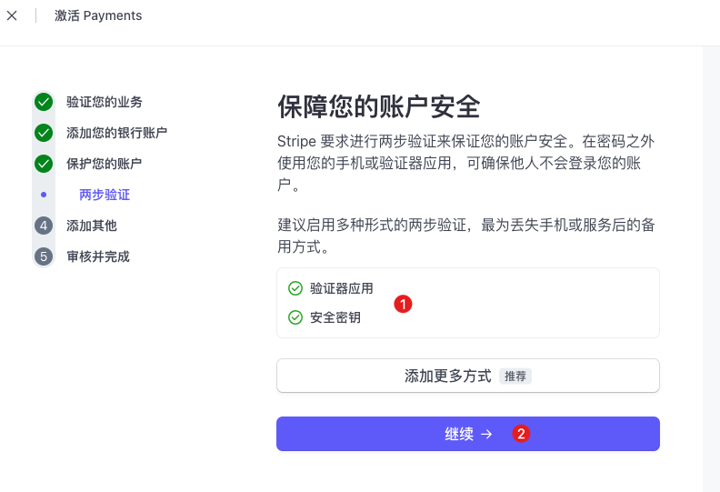

① Este paso es la verificación en dos pasos de la cuenta Stripe, operar según los requisitos, bastante simple.

---
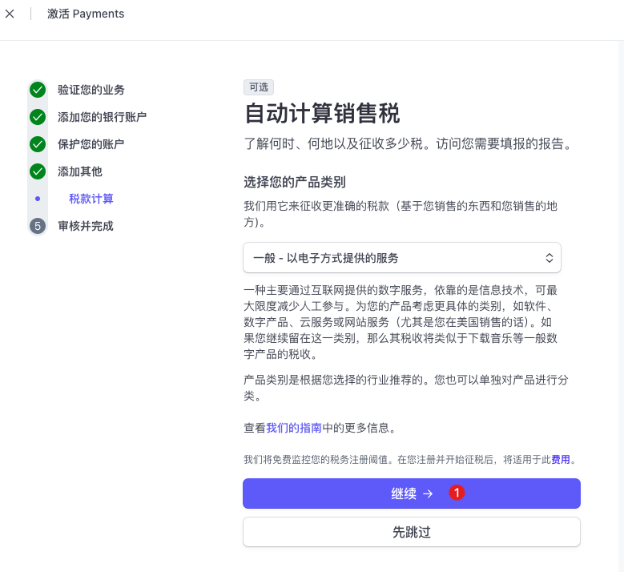

① Seleccionar método de cálculo de impuestos, seleccioné el método predeterminado: General - servicios proporcionados electrónicamente. También puedes ver otros métodos, seleccionar el que sea adecuado para ti, si no sabes cuál es adecuado, seleccionar el predeterminado.

---
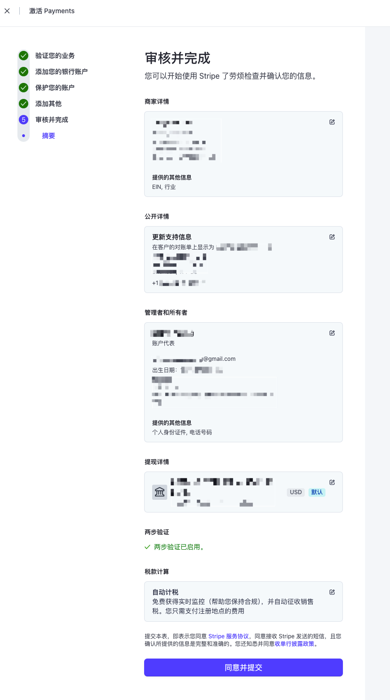

Hasta este paso, la parte de llenar información básicamente está completa, hacer clic directamente en "Aceptar y enviar", luego debería saltar a una página de "Complementar materiales de verificación de identidad", ¿recuerdas haber llenado el número de cédula de identidad antes? Aquí necesitas subir o fotografiar y subir fotos de la cédula de identidad.

---
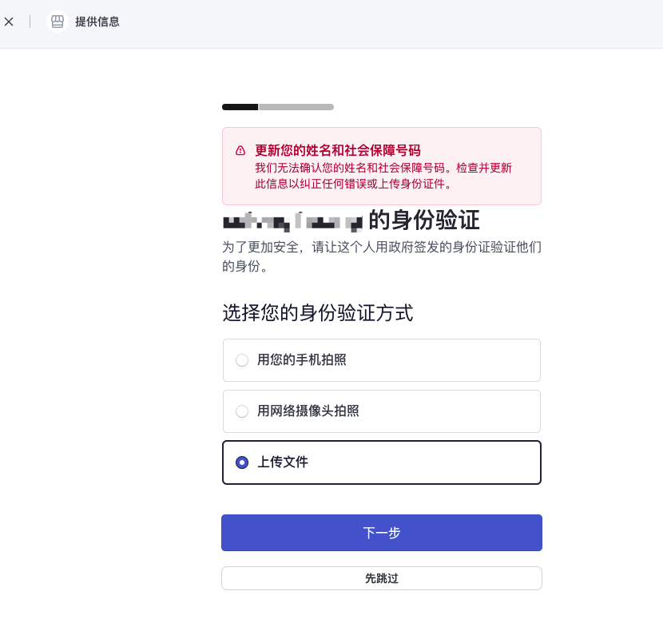

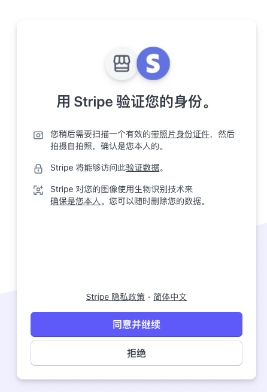

Este paso es "Complementar verificación de materiales de identidad", seleccionar la forma conveniente para subir materiales de identidad, es mejor preparar con anticipación fotos del frente y reverso de la cédula de identidad, luego subirlas directamente.

---
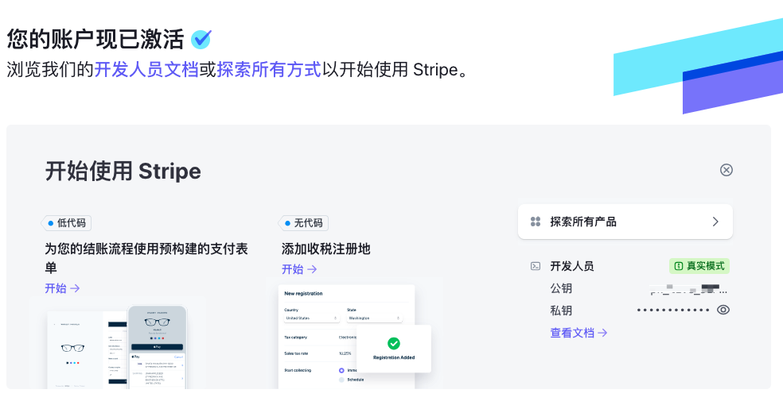

Después de completar todos los pasos anteriores, saltará a la página de "Activación exitosa", ¡en este momento nuestra activación de Stripe está completa! Lo que queda es que nosotros mismos, según la documentación de Stripe, integremos el pago a nuestro sitio web.

## 2. Palabras finales
Bueno, hasta aquí, hemos completado todo el flujo de recepción de pagos de sitios web internacionales. Antes de caminar sentía que era bastante problemático, pero tenía que hacerlo yo mismo. Durante el proceso, encontré varios problemas, varias situaciones inesperadas, intenté explorar, completé todo el proceso, tomó más de un mes en total.

Ahora mirando hacia atrás, estas experiencias valen la pena. Solo después de caminar por ti mismo una vez, sabes de qué se trata, la próxima vez será mucho más simple.

Si estas experiencias pueden serte de ayuda, ¡estaré muy feliz!

Al final, les deseo a todos y a mí mismo: en el camino de la internacionalización, navegando con el viento, todo saldrá bien, ¡cosechando abundantemente!
