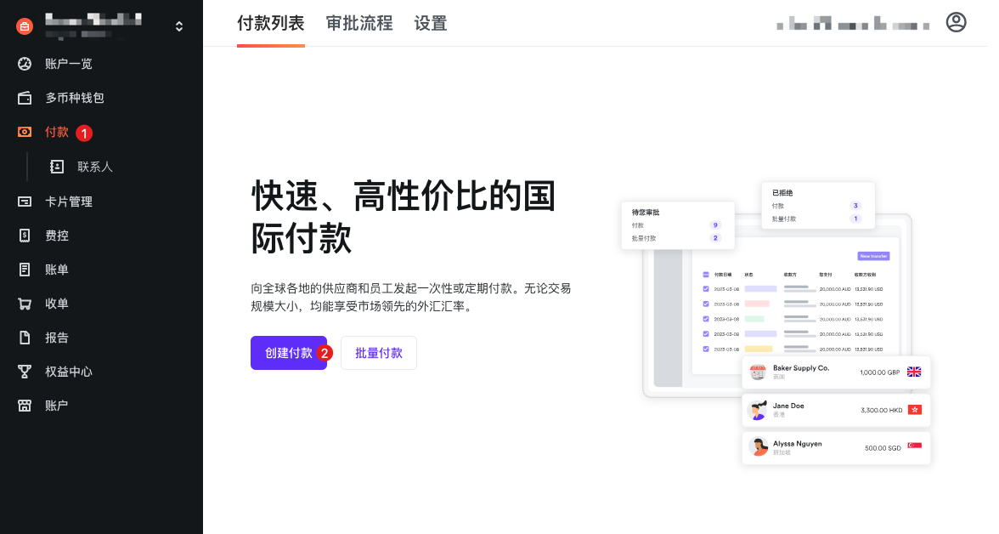
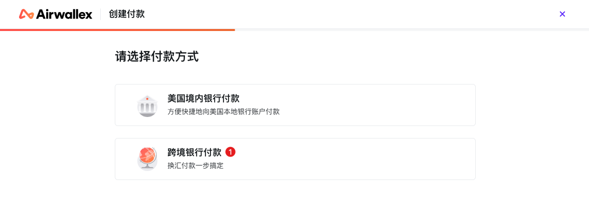
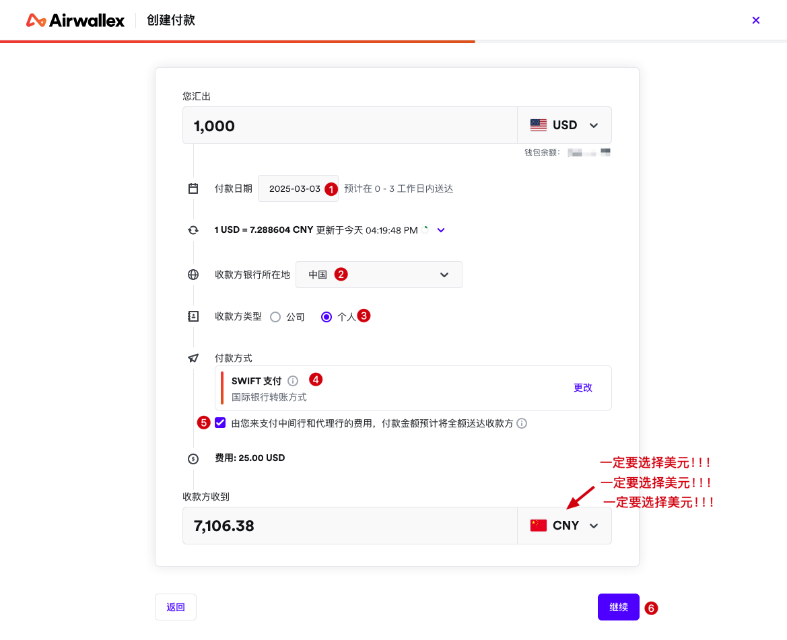
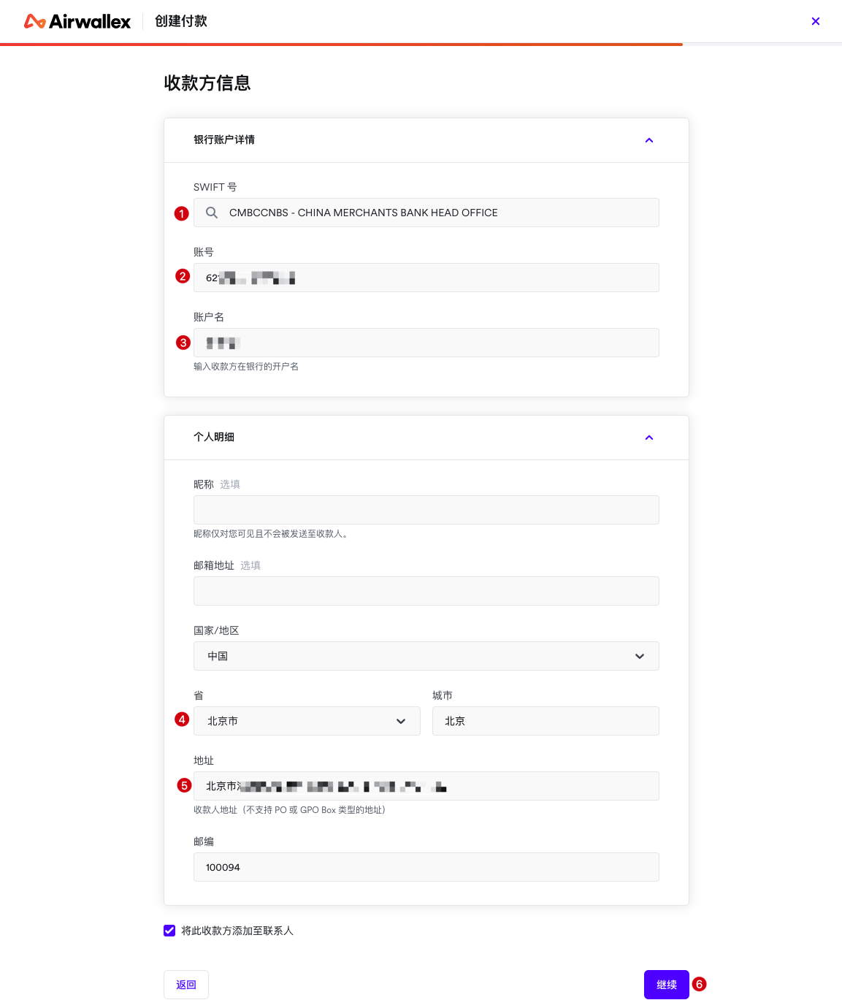
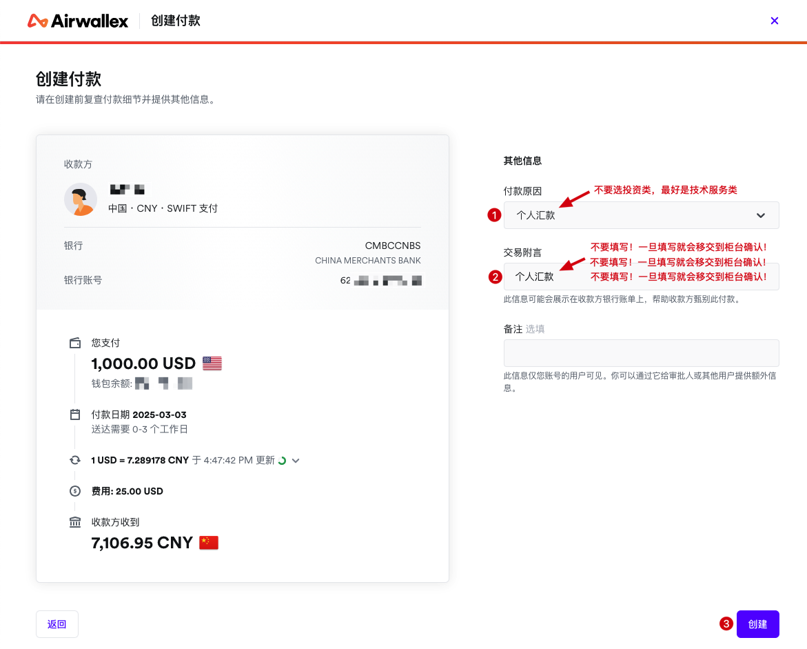
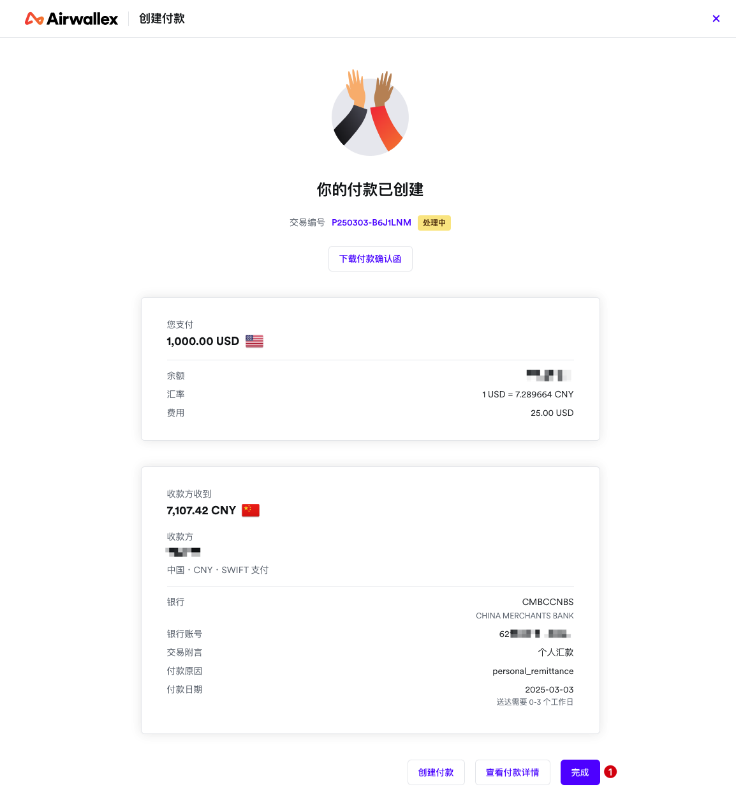
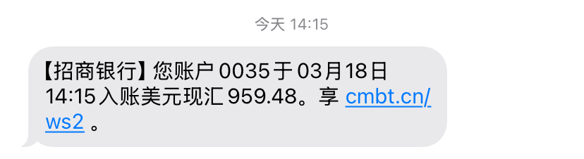

# Transferencia de Fondos al País de Origen

Hola a todos, ha pasado un tiempo desde la última actualización. Justo ahora recibí un mensaje del banco, ¡finalmente logré transferir los fondos exitosamente al país!

A continuación voy a compartir con todos el proceso detallado de transferencia de fondos. Durante este proceso encontré algunos obstáculos, espero poder ayudarles a evitarlos.

Primero debo decir que las siguientes capturas de pantalla fueron tomadas cuando solicité la transferencia por primera vez, algunos obstáculos ya están marcados en las imágenes, pueden revisarlos.

Además, uso la plataforma Airwallex, si usan otras plataformas, también pueden usarlo como referencia.

## 1. Crear pago

Después de iniciar sesión en el backend de Airwallex, hacer clic en ① Pagos -> ② Crear pago

## 2. Seleccionar método de pago

① Seleccionar pago bancario transfronterizo

## 3. Llenar información de transferencia

Este paso es muy crítico, asegúrense de llenarlo correctamente:
- Seleccionar la cantidad que quieren transferir

- ① Seleccionar fecha de transferencia, probé dos veces, ambas llegaron al día siguiente

- ② Seleccionar "China" para la ubicación del banco receptor

- ③ Tipo de receptor: Personal

- ④ Método de pago seleccionar "Pago SWIFT"

- ⑤ Esto pueden seleccionarlo o no, se puede entender como "envío pago" vs "pago contra entrega"

- La tarifa de Airwallex es 2.5%, no es alta ni baja

- **Atención especial**: `¡La moneda que recibe el receptor debe seleccionar USD (dólares estadounidenses)! Este es el primer obstáculo que encontré, la primera vez que transferí, seleccioné CNY (yuan chino), la transferencia llegó a China Merchants Bank, el banco me llamó pidiendo que proporcionara pruebas, necesitaba demostrar que estos fondos venían de canales legítimos, como contratos, etc., dijeron que cada yuan debe tener una fuente específica clara, si no, no pueden acreditar.`

- ⑥ Siguiente paso

## 4. Información del receptor

Este paso llenar según los requisitos:

- ① Seleccionar el código SWIFT del banco receptor correspondiente, tengo una tarjeta de China Merchants Bank de Beijing, así que seleccioné el código de la sede de China Merchants Bank, si pueden encontrar el código de su banco de apertura seleccionen el del banco de apertura, si no seleccionen el de la sede

- ② Número de tarjeta bancaria receptora, nota primero confirmar si tu tarjeta bancaria es de doble moneda, China Merchants Bank en la app en "Finanzas Transfronterizas"

- ③ Nombre de la cuenta es el nombre del titular de la tarjeta bancaria receptora

- ④ ⑤ Llenar tu dirección, en chino está bien

- ⑥ Siguiente paso

## 5. Razón del pago

Este paso es el segundo obstáculo que encontré:

- ① Razón del pago: Tratar de seleccionar "Servicios técnicos", no seleccionar cosas extrañas, después pregunté al personal de China Merchants Bank, "Remesa personal" también es bastante ambigua, no recomendada, "Servicios técnicos" es más claro

- ② Comentario de transacción: `¡Definitivamente no llenar!!! El personal de China Merchants Bank me dijo que cuando la cantidad no es grande, si hay comentario de transacción, esta remesa también pasará por revisión manual en ventanilla, te llamarán, pedirán pruebas, así que cuando la cantidad no es grande (menos de diez mil dólares estadounidenses, creo que es así), no llenar comentarios, así en situaciones normales se acredita directamente`

- ③ Completar pago

## 6. Completar pago

Hasta aquí, todo el proceso de pago está creado.

## 7. Registro de eventos

Originalmente creé el pago el 3 de marzo, el 4 de marzo el banco me llamó, no recibí la llamada, olvidé devolver la llamada, después de unos días lo recordé, llamé de vuelta, el banco dijo que esto era en yuan, necesitaba proporcionar materiales de prueba de fuente legítima para acreditar, no tuve más remedio que elegir reembolso, después de aproximadamente 3～4 días, el reembolso fue exitoso, dedujo tarifas de servicio (no fue China Merchants Bank quien las dedujo).

Después de unos días más, ayer recreé el pago, esta mañana el banco me llamó para confirmar, resultó que era porque llené "comentario de transacción", esta transacción pasaría por confirmación manual en ventanilla.

En este momento estaba completamente agotado, pensando que tendría que reembolsar otra vez, pero afortunadamente la cantidad era relativamente pequeña, el personal de China Merchants Bank también era bastante amigable, finalmente completé el depósito bastante exitosamente.

Así que, cuando transfieren fondos de vuelta al país, asegúrense de prestar atención a los dos obstáculos anteriores:
- **Seleccionar dólares estadounidenses (USD) para la moneda de depósito**
- **No llenar comentario de transacción, todo lo que puedan no llenar, no lo llenen**
